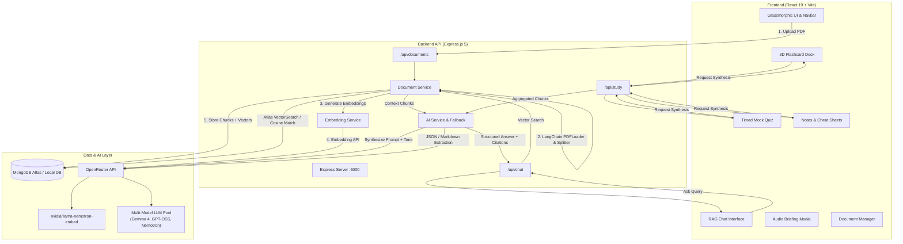

# 🚀 DocsSynth — AI Document Intelligence & Active Recall Study Suite

<div align="center">


[](https://react.dev/)
[](https://vitejs.dev/)
[](https://nodejs.org/)
[](https://expressjs.com/)
[](https://www.mongodb.com/)
[](https://openrouter.ai/)
[](https://js.langchain.com/)
[](LICENSE)

**Transform dense lecture notes, textbooks, and research papers into interactive study companions, active recall flashcards, timed mock tests, and spoken audio podcasts.**

[Features](#-core-features) • [Architecture](#-system-architecture) • [Getting Started](#-getting-started) • [API Reference](#-api-reference) • [Design Specs](docs/design.md)

</div>

---

## 📖 Overview

**DocsSynth** is a modern, full-stack Retrieval-Augmented Generation (RAG) platform tailored for students, researchers, and lifelong learners. Traditional document search only returns raw snippets; DocsSynth synthesizes complex documents into actionable learning workflows:

1. **Ask Contextual Questions** with precise chunk citations and adjustable learning personas (ELI5, Exam Prep, Deep Dive).
2. **Train with 3D Active Recall Flashcards** featuring flip animations, key memory cues, and spaced repetition tracking.
3. **Simulate Real Exams** with timed multiple-choice practice quizzes and instant conceptual explanations.
4. **Export Rapid Revision Cheat Sheets & Study Guides** with formulas, comparison tables, and Markdown/print support.
5. **Listen On-the-Go** with browser-native text-to-speech audio briefings.

---

## ✨ Core Features

### 1. 💬 RAG-Powered AI Study Chat
- **Document Chunk Retrieval**: Vector similarity search (Atlas Vector Search + In-memory Cosine fallback) pinpoints the exact 900-character passages relevant to your query.
- **Dynamic Learning Personas**:
  - `Standard`: Balanced, clear academic explanations.
  - `ELI5 (Simple)`: Real-world analogies and intuitive beginner explanations.
  - `Exam Prep`: High-yield test questions, mnemonics, and scoring tips.
  - `Deep Dive`: In-depth theoretical breakdowns and architectural mechanics.
- **Transparent Citations**: Expandable source drawer displays chunk numbers, similarity match scores, and text excerpts.
- **Preset Chips**: One-click prompts for instant summaries, formulas, or exam questions.

### 2. 🗂️ 3D Active Recall Flashcard Decks
- **Interactive 3D Deck**: CSS 3D card flipping (`rotateY`) with keyboard shortcuts (Space to flip, Left/Right arrows to navigate).
- **Exam Memory Points**: High-yield bullet points extracted directly from document content.
- **Mastery Tracking & Confetti**: Mark cards as *"Still Learning"* or *"Mastered!"* with celebration confetti upon complete deck mastery.
- **TTS Audio Support**: Hear questions and answers read aloud.

### 3. 📝 Timed Mock Exams & Practice Quizzes
- **Custom Difficulty**: Generate tests on Easy, Medium, or Hard difficulty levels.
- **Live Stopwatch**: Real-time timer to simulate exam pressure.
- **Detailed Explanations**: Post-submission breakdown with correct answers and underlying reasoning.
- **Interactive Scorecard**: Performance percentage with visual badges and retake capabilities.

### 4. ⚡ Executive Study Guides & Rapid Cheat Sheets
- **Two Distinct Synthesis Modes**:
  - **Full Study Guide**: Executive overview, key takeaways, and comprehensive subject breakdowns.
  - **Rapid Cheat Sheet**: 10-second snapshots, comparison matrices, workflows, and golden formulas.
- **Export & Print Ready**: One-click export to `.md` files or browser print formatting.

### 5. 🎙️ Spoken Audio Study Briefing (Podcast Mode)
- **Commuter Learning**: Generates cleaned spoken audio summaries via the browser's native Web Speech API.
- **Playback Controls**: Play, pause, restart, and adjust playback speeds (0.8x, 1.0x, 1.25x, 1.5x).
- **Visual Waveform**: Animated audio visualizer waveform synced with playback state.

### 6. 📂 In-Browser Document Management & Vector Chunk Inspector
- **Drag-and-Drop Ingestion**: Upload PDFs up to 25MB with automated text parsing and vector indexing.
- **Chunk Inspector**: Browse individual document chunks, chunk lengths, and metadata stored in MongoDB.
- **Sample Preloader**: Quickstart with built-in "Operating Systems" lecture material.

### 7. 🛡️ Multi-Tier Resilience & Fallback Engine
- **Multi-Model LLM Routing**: Cascades through OpenRouter free models (`google/gemma-4-31b-it:free`, `openai/gpt-oss-20b:free`, `liquid/lfm-2.5-2.6b:free`, `nvidia/nemotron-3-nano-30b-a3b:free`) to prevent rate-limit downtime.
- **Local Smart Synthesizer Fallback**: Deterministic fallback engine generates structured cards, quizzes, and summaries if all external LLM APIs are offline.

---

## 🏗️ System Architecture



---

## 💻 Tech Stack

| Domain | Technology | Purpose |
| :--- | :--- | :--- |
| **Frontend Framework** | React 19 + Vite 8 | Ultra-fast client rendering, modern hooks, and HMR |
| **Styling & Theme** | Vanilla CSS + Glassmorphism | Custom design tokens, dark/light modes, 3D CSS transforms |
| **UI Components** | Lucide React | High-contrast modern vector iconography |
| **Markdown Rendering** | React-Markdown | Formatted rendering of tables, code blocks, and formulas |
| **Gamification** | Canvas-Confetti | Celebration effects upon quiz completion & card mastery |
| **Audio Synthesis** | Web Speech API (`SpeechSynthesis`) | Browser-native audio podcast briefings without external API costs |
| **Backend Server** | Express.js 5 (ES Modules) | High-performance RESTful API routing and middleware |
| **File Uploads** | Multer | Multipart/form-data PDF upload handler |
| **Document Processing** | `@langchain/community` & `@langchain/textsplitters` | PDF parsing and recursive text chunking |
| **Database & Vectors** | MongoDB Atlas (`mongodb` driver) | Document chunk storage & `$vectorSearch` index |
| **Embedding Model** | `nvidia/llama-nemotron-embed-vl-1b-v2:free` | High-dimensional semantic text embeddings |
| **LLM Inference** | `@openrouter/sdk` | Multi-model fallback chain across leading open-source models |

---

## 🚀 Getting Started

### Prerequisites

Ensure you have the following installed on your machine:
- **Node.js**: `v18.18.0` or higher ([Download Node.js](https://nodejs.org/))
- **npm**: `v9.0.0` or higher
- **MongoDB**: A free MongoDB Atlas cluster or a local MongoDB instance ([MongoDB Atlas](https://www.mongodb.com/atlas))
- **OpenRouter API Key**: Free API key from [OpenRouter](https://openrouter.ai/keys)

---

### 1. Clone & Install Dependencies

```bash
# Clone the repository
git clone https://github.com/your-username/DocsSynth.git
cd DocsSynth

# Install Backend dependencies
cd Backend
npm install

# Install Frontend dependencies
cd ../frontend
npm install
```

---

### 2. Configure Environment Variables

#### Backend Configuration (`Backend/.env`)
Create a `.env` file in the `Backend/` directory:

```env
# Server Port
PORT=5000

# OpenRouter API Key (https://openrouter.ai/keys)
OPENROUTER_API_KEY=your_openrouter_api_key_here

# MongoDB Atlas or Local MongoDB Connection String
MongoDB=mongodb+srv://<username>:<password>@cluster0.mongodb.net/?appName=DocsSynth
```

*(You can copy from `Backend/.env.example`)*

#### Frontend Configuration (`frontend/.env`)
Create a `.env` file in the `frontend/` directory (optional if running on default port 5000):

```env
VITE_API_URL=http://localhost:5000
```

*(You can copy from `frontend/.env.example`)*

---

### 3. Setup MongoDB Atlas Vector Search Index *(Recommended)*

To enable hardware-accelerated Vector Search in MongoDB Atlas:

1. Log in to **MongoDB Atlas** → Navigate to **Atlas Search** tab.
2. Select **Create Search Index** → Choose **JSON Editor**.
3. Target Database: `DocsSynth`, Collection: `Private_DOCS`.
4. Name the index `vector_index` and paste this configuration:

```json
{
  "fields": [
    {
      "type": "vector",
      "path": "embedding",
      "numDimensions": 1024,
      "similarity": "cosine"
    },
    {
      "type": "filter",
      "path": "fileName"
    }
  ]
}
```

> **Note**: If vector indexing is not configured, DocsSynth **automatically falls back** to an in-memory cosine similarity engine with zero configuration!

---

### 4. Running the Application

#### Start Backend Server
```bash
cd Backend
npm run dev
# Server starts on http://localhost:5000
```

#### Start Frontend Client
In a new terminal tab:
```bash
cd frontend
npm run dev
# Vite client starts on http://localhost:5173
```

Open your browser at `http://localhost:5173` to access DocsSynth! 🎉

---

## 📡 REST API Reference

For detailed schema definitions and sample payloads, see [docs/API.md](docs/API.md).

| Method | Endpoint | Description | Sample Body |
| :--- | :--- | :--- | :--- |
| `GET` | `/api/health` | Backend and MongoDB health check | `None` |
| `GET` | `/api/documents` | List all indexed documents & chunk counts | `None` |
| `POST` | `/api/documents/upload` | Upload & chunk PDF file (`multipart/form-data`) | `file: <binary>` |
| `GET` | `/api/documents/:fileName/chunks` | Get all extracted text chunks for a document | `None` |
| `DELETE` | `/api/documents/:fileName` | Delete document and associated vectors | `None` |
| `POST` | `/api/documents/preload-sample` | Preload built-in "Operating System" sample PDF | `None` |
| `POST` | `/api/chat` | Contextual RAG query with tone selection | `{"message": "What is RTOS?", "fileName": "OS.pdf", "studentMode": "exam"}` |
| `POST` | `/api/study/flashcards` | Generate active recall flashcards | `{"fileName": "OS.pdf", "count": 6}` |
| `POST` | `/api/study/quiz` | Generate multiple-choice practice quiz | `{"fileName": "OS.pdf", "count": 5, "difficulty": "Medium"}` |
| `POST` | `/api/study/summary` | Generate executive study guide | `{"fileName": "OS.pdf"}` |
| `POST` | `/api/study/cheatsheet` | Generate rapid exam cheat sheet | `{"fileName": "OS.pdf"}` |

---

## 📂 Project Directory Structure

```text
DocsSynth/
├── Backend/                        # Express.js Backend API Server
│   ├── chains/                     # LangChain retrieval & QA logic
│   │   ├── qaChain.js              # Question embedding generator
│   │   └── retrievalChain.js       # Vector search & document retrieval
│   ├── config/
│   │   └── db.js                   # MongoDB connection client & pool
│   ├── embeddings/
│   │   └── embeddingService.js     # OpenRouter embedding interface
│   ├── routes/
│   │   ├── chatRoutes.js           # RAG study chat routes
│   │   ├── documentRoutes.js       # PDF upload, listing & chunk inspection
│   │   └── studyRoutes.js          # Flashcards, Quiz, Summary & Cheat Sheet
│   ├── services/
│   │   ├── aiService.js            # LLM fallback pool & structured parsing
│   │   ├── documentService.js      # PDF loading, splitting & vector search
│   │   └── embeddingService.js     # Vector embedding batch generator
│   ├── uploads/                    # Temporary PDF upload storage
│   ├── .env.example                # Backend environment variable template
│   ├── package.json                # Backend dependencies & scripts
│   ├── prepare.js                  # Document preparation utility
│   ├── rag.js                      # Standalone RAG execution script
│   └── server.js                   # Main Express application entrypoint
│
├── frontend/                       # React 19 + Vite Frontend SPA
│   ├── public/                     # Static assets & favicon
│   ├── src/
│   │   ├── assets/                 # SVGs and images
│   │   ├── components/
│   │   │   ├── AudioStudyBrief.jsx # Spoken audio podcast modal (Web Speech)
│   │   │   ├── ChatInterface.jsx   # RAG Chat with personas & citations
│   │   │   ├── CheatSheetView.jsx  # Markdown study notes & cheat sheet
│   │   │   ├── DocumentUpload.jsx  # Drag-and-drop PDF manager & chunk viewer
│   │   │   ├── FlashcardsDeck.jsx  # 3D active recall deck with SRS tracking
│   │   │   ├── Navbar.jsx          # Top navigation, theme toggle & status
│   │   │   └── QuizMode.jsx        # Timed mock exams with instant feedback
│   │   ├── services/
│   │   │   └── api.js              # Centralized client API service
│   │   ├── App.css                 # Application layout styles
│   │   ├── App.jsx                 # Root application component & state hub
│   │   ├── index.css               # Design system tokens, glassmorphism & 3D CSS
│   │   └── main.jsx                # React DOM root entrypoint
│   ├── .env.example                # Frontend environment variable template
│   ├── index.html                  # HTML5 entrypoint
│   ├── package.json                # Frontend dependencies & scripts
│   └── vite.config.js              # Vite bundler configuration
│
├── docs/                           # Documentation Directory
│   ├── API.md                      # Detailed REST API specification
│   ├── design.md                   # Complete system design & architecture specs
│   └── DEPLOYMENT.md               # Production deployment guide (Vercel + Render)
│
├── requirements.txt                # Unified dependency & system specification
├── requirement.txt                 # Specification alias
├── .gitignore                      # Git ignored files & directories
└── README.md                       # Comprehensive project documentation
```

---

## 🎨 UI/UX Design System Highlights

- **Palette**: Tailwind-inspired deep indigo (`#6366F1`), cyan (`#06B6D4`), emerald (`#10B981`), amber (`#F59E0B`), and rose (`#F43F5E`).
- **Glassmorphism**: Backdrop blur (`backdrop-filter: blur(16px)`), subtle translucent borders, and soft glow drop shadows.
- **Dark & Light Modes**: Instant theme toggle with local storage persistence and CSS custom properties (`--bg-app`, `--text-primary`, `--bg-card`).
- **3D Card Flip**: Smooth GPU-accelerated CSS 3D transforms (`perspective: 1000px`, `transform: rotateY(180deg)`).
- **Responsive Layout**: Designed for seamless learning across desktops, tablets, and mobile devices.

---

## 🤝 Contributing

Contributions, issues, and feature requests are welcome!
1. Fork the Project
2. Create your Feature Branch (`git checkout -b feature/AmazingFeature`)
3. Commit your Changes (`git commit -m 'Add some AmazingFeature'`)
4. Push to the Branch (`git push origin feature/AmazingFeature`)
5. Open a Pull Request

---

## 📄 License

This project is licensed under the **ISC License**.

---

<div align="center">
Made with ❤️ for Students, Educators, and Lifelong Learners.
</div>
