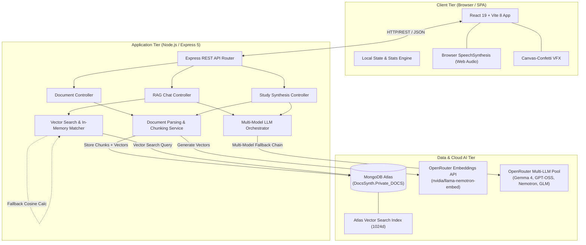
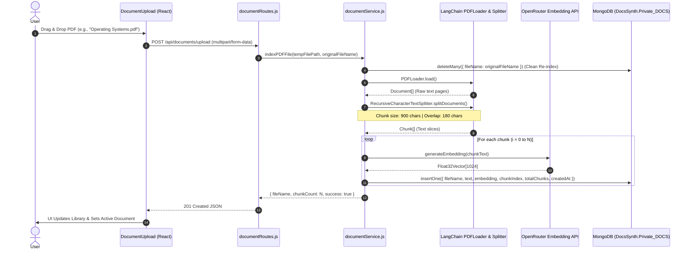
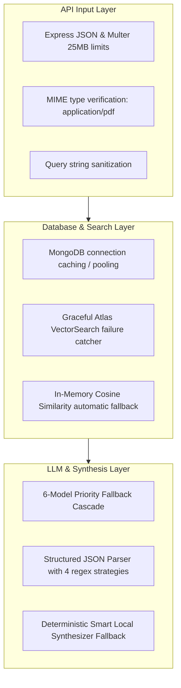

# 🏛️ DocsSynth — System Design & Architecture Document

<div align="center">

**DocsSynth: Full-Stack AI Document Intelligence & Active Recall Study Suite**  
*Comprehensive Technical Architecture, Ingestion Pipelines, Vector Search Mechanics, and UI/UX Design System*

---

</div>

## 📑 Table of Contents
1. [Executive Summary & Objectives](#1-executive-summary--objectives)
2. [High-Level Architecture](#2-high-level-architecture)
3. [Ingestion & Document Processing Pipeline](#3-ingestion--document-processing-pipeline)
4. [Vector Search & Embedding Infrastructure](#4-vector-search--embedding-infrastructure)
5. [LLM Orchestration & Prompt Engineering](#5-llm-orchestration--prompt-engineering)
6. [Frontend Architecture & State Flow](#6-frontend-architecture--state-flow)
7. [Database Schema & Data Contracts](#7-database-schema--data-contracts)
8. [UI/UX Design System & Token Specification](#8-uiux-design-system--token-specification)
9. [Resilience, Error Handling & Fallbacks](#9-resilience-error-handling--fallbacks)
10. [Performance, Scalability & Benchmarks](#10-performance-scalability--benchmarks)
11. [Security & Compliance](#11-security--compliance)
12. [Future Roadmap & Extensibility](#12-future-roadmap--extensibility)

---

## 1. Executive Summary & Objectives

### 1.1 Problem Statement
Students and researchers face significant cognitive overload when reviewing dense course materials, textbooks, and scientific papers. Passive reading yields low knowledge retention (~10–20% after 48 hours according to the Ebbinghaus forgetting curve). While LLMs can summarize text, standard AI chatbots suffer from hallucinations, lack document grounding, and do not provide structured study workflows (active recall, flashcards, mock quizzes, spaced repetition, and audio briefings).

### 1.2 DocsSynth Solution
DocsSynth combines **Retrieval-Augmented Generation (RAG)** with cognitive science principles (Active Recall, Spaced Repetition, and Multimodal Learning) to convert unstructured documents into interactive study units:

- **Strict Grounding**: Answers are grounded directly in extracted PDF passages with verifiable citation chunks.
- **Adaptive Personas**: Tone tuning across Standard, ELI5 (intuitive analogies), Exam Prep (high-yield questions), and Deep Dive (theoretical breakdown).
- **Gamified Active Recall**: 3D interactive flashcards, timed multiple-choice practice exams with instant explanations, and celebration animations.
- **Spoken Audio Podcasts**: Browser-native Web Speech synthesis for commuter learning without external API latency or costs.
- **Zero-Config Resilience**: Automatic fallback across a multi-model LLM pool and in-memory vector search if Atlas vector search or cloud models are unavailable.

---

## 2. High-Level Architecture

DocsSynth follows a decoupled, three-tier microservice architecture:



---

## 3. Ingestion & Document Processing Pipeline

The ingestion pipeline transforms raw, heterogeneous PDF documents into semantically rich, high-dimensional vector embeddings stored with granular chunk metadata.



### 3.1 Chunking Strategy & Parameter Rationalization
- **Chunk Size**: `900 characters` (~180–225 tokens). This provides sufficient semantic context for a single atomic concept (e.g., "Context Switching Mechanics" or "Deadlock Prevention Conditions") without overflowing the attention budget during multi-chunk retrieval.
- **Chunk Overlap**: `180 characters` (20% overlap). Prevents loss of continuity across sentence boundaries and ensures formulas or definition clauses spanning cut boundaries are captured in at least one adjacent chunk.
- **Split Separators**: Prioritizes double newlines `\n\n` (paragraphs), single newlines `\n` (headers/bullets), periods `. ` (sentences), and spaces ` ` (words).

---

## 4. Vector Search & Embedding Infrastructure

### 4.1 Embedding Model
- **Model**: `nvidia/llama-nemotron-embed-vl-1b-v2:free` via OpenRouter SDK.
- **Dimensions**: `1024-dimensional float vector`.
- **Encoding Format**: Normalized `float` arrays allowing direct Euclidean dot-product calculation for cosine similarity.

### 4.2 Two-Tier Retrieval Architecture (Hardware + In-Memory Fallback)

DocsSynth implements a resilient retrieval strategy:

```mermaid
flowchart TD
    Q[User Query / Study Topic] --> Emb[Generate Query Embedding (1024d)]
    Emb --> TryAtlas{Attempt MongoDB<br/>$vectorSearch Pipeline?}
    
    TryAtlas -->|Success| AtlasRes[Atlas Vector Search Candidates]
    AtlasRes --> CheckResults{Chunks Found?}
    CheckResults -->|Yes| ReturnChunks[Return Top-K Scored Context Chunks]
    
    TryAtlas -->|Atlas Index Not Configured / Error| Fallback[In-Memory Cosine Similarity Engine]
    CheckResults -->|No / Empty| Fallback
    
    Fallback --> FetchAll[Fetch Document Chunks from MongoDB]
    FetchAll --> CalcSim["Calculate Cosine Similarity:<br/>dot(vecA, vecB) / (|vecA| * |vecB|)"]
    CalcSim --> Sort[Sort by Descending Match Score]
    Sort --> ReturnChunks
```

#### Cosine Similarity Equation:
$$\text{Similarity}(\mathbf{A}, \mathbf{B}) = \frac{\mathbf{A} \cdot \mathbf{B}}{\|\mathbf{A}\|_2 \|\mathbf{B}\|_2} = \frac{\sum_{i=1}^{n} A_i B_i}{\sqrt{\sum_{i=1}^{n} A_i^2} \sqrt{\sum_{i=1}^{n} B_i^2}}$$

### 4.3 MongoDB Atlas Search Index Definition
```json
{
  "fields": [
    {
      "type": "vector",
      "path": "embedding",
      "numDimensions": 1024,
      "similarity": "cosine"
    },
    {
      "type": "filter",
      "path": "fileName"
    }
  ]
}
```

---

## 5. LLM Orchestration & Prompt Engineering

### 5.1 Multi-Model Fallback Chain
To guarantee 99.9% uptime despite third-party rate limits on free-tier APIs, the `aiService.js` engine loops sequentially through a prioritized pool of LLMs:

```javascript
const MODELS = [
  "openrouter/free",
  "google/gemma-4-31b-it:free",
  "openai/gpt-oss-20b:free",
  "liquid/lfm-2.5-2.6b:free",
  "nvidia/nemotron-3-nano-30b-a3b:free",
  "z-ai/glm-5.2:free",
];
```

If all external LLM endpoints fail or rate-limit, the service immediately routes to the **DocsSynth Smart Contextual Synthesizer**, generating structured study cards, quizzes, and notes locally using deterministic heuristic extraction.

### 5.2 Dynamic Student Persona Conditioning

| Student Mode | System Prompt Directive | Target Use Case |
| :--- | :--- | :--- |
| **Standard** | *"You are DocsSynth AI, a warm, clear, and encouraging study mentor helping a student master this material."* | General homework assistance and concept Q&A. |
| **ELI5 (Simple)** | *"Explain using intuitive real-world analogies, step-by-step logic, and simple everyday metaphors."* | First-time learning and breaking down intimidating topics. |
| **Exam Prep** | *"Focus on high-yield exam points, likely test questions, scoring rubrics, and precise technical definitions."* | Cramming, pre-exam review, and high-frequency syllabus points. |
| **Deep Dive** | *"Provide an in-depth academic breakdown with underlying mechanics, architectural trade-offs, and thorough proofs."* | Advanced engineering, honors courses, and research synthesis. |

### 5.3 Structured JSON Extraction Engine
To prevent malformed LLM markdown artifacts from breaking frontend JSON parsing, the `extractJSON` utility enforces multi-strategy extraction:
1. Native `JSON.parse(text)`
2. Markdown block extraction (regex ` ```json\s*([\s\S]*?)\s*``` `)
3. Substring array bounding (`text.indexOf('[')` to `text.lastIndexOf(']')`)
4. Substring object bounding (`text.indexOf('{')` to `text.lastIndexOf('}')`)

---

## 6. Frontend Architecture & State Flow

The frontend is organized as a component-driven Single Page Application (SPA) using React 19 and Vite 8:

```mermaid
graph TD
    App[App.jsx - Central State Hub]
    App --> Navbar[Navbar.jsx]
    App --> Banner[Study Motivation & Streak Banner]
    App --> TabNav[Tab Navigation Bar]
    
    TabNav -->|Tab: chat| ChatInterface[ChatInterface.jsx]
    TabNav -->|Tab: flashcards| FlashcardsDeck[FlashcardsDeck.jsx]
    TabNav -->|Tab: quiz| QuizMode[QuizMode.jsx]
    TabNav -->|Tab: notes| CheatSheetView[CheatSheetView.jsx]
    TabNav -->|Tab: upload| DocumentUpload[DocumentUpload.jsx]

    App --> AudioStudyBrief[AudioStudyBrief.jsx - Modal]

    Navbar --> ThemeToggle[Theme Switcher (Dark/Light)]
    Navbar --> DocSelector[Active Document Dropdown]
    Navbar --> StatsWidget[Streak & Mastery Counters]
    Navbar --> ServerStatus[Health Status Indicator]

    ChatInterface --> ReactMarkdown[Markdown Body + Citations]
    FlashcardsDeck --> FlipCards[3D CSS Perspective Cards]
    QuizMode --> TimedQuiz[Stopwatch + Scorecard + Explanations]
    CheatSheetView --> MarkdownNotes[Export .md / Print Handler]
```

### 6.1 State Management & Persistence
- **Active Document (`activeDoc`)**: Shared across all study tabs; switching document triggers immediate re-querying of flashcards, quizzes, and summaries.
- **Theme State (`theme`)**: Persisted in `localStorage ("docssynth_theme")` and applied to `document.documentElement` via `data-theme="dark|light"`.
- **Study Stats (`studyStats`)**: Tracks `streakDays`, `masteredCount`, and `quizScoreAvg` stored in `localStorage ("docssynth_stats")`.
- **Speech Synthesis**: Synchronous control of `window.speechSynthesis` with pause, resume, cancel, and variable playback rates (`0.8x` to `1.5x`).

---

## 7. Database Schema & Data Contracts

### 7.1 MongoDB Collection: `DocsSynth.Private_DOCS`

```typescript
interface DocumentChunk {
  _id: ObjectId;                  // MongoDB Unique Identifier
  fileName: string;               // e.g., "Operating System .pdf"
  text: string;                   // Text chunk payload (~900 chars)
  embedding: number[];            // 1024-dimensional float vector array
  chunkIndex: number;             // 1-based sequential chunk index
  totalChunks: number;            // Total chunks in source document
  createdAt: Date;                // Upload timestamp
}
```

### 7.2 API Data Contracts

#### Chat Completion Response
```json
{
  "success": true,
  "query": "What is multiprogramming?",
  "answer": "### Multiprogramming\n\nMultiprogramming keeps multiple jobs in memory...",
  "model": "google/gemma-4-31b-it:free",
  "sources": [
    {
      "chunkIndex": 2,
      "fileName": "Operating System .pdf",
      "snippet": "In a multiprogramming system, the CPU is never left idle...",
      "score": 0.89
    }
  ]
}
```

#### Flashcard Generation Response
```json
{
  "success": true,
  "count": 6,
  "flashcards": [
    {
      "id": 1,
      "question": "What is the primary motivation for Multiprogramming?",
      "answer": "To keep the CPU busy by switching to another process whenever the active job waits on slow I/O operations.",
      "keyPoints": [
        "Eliminates CPU idle wait time",
        "Higher overall resource throughput"
      ],
      "difficulty": "Medium",
      "topic": "Process Management"
    }
  ]
}
```

#### Practice Quiz Response
```json
{
  "success": true,
  "count": 5,
  "quiz": [
    {
      "id": 1,
      "question": "Which operating system guarantees deterministic task completion within strict deadlines?",
      "options": [
        "RTOS (Real-Time Operating System)",
        "Windows 11 Home",
        "macOS Sonoma",
        "Ubuntu Desktop"
      ],
      "correctIndex": 0,
      "explanation": "RTOS is engineered specifically for deterministic timing constraints in automotive, avionics, and robotics.",
      "topic": "OS Architectures"
    }
  ]
}
```

---

## 8. UI/UX Design System & Token Specification

DocsSynth uses a glassmorphic design system tailored for focus and reduced visual fatigue:

### 8.1 Color Palette Tokens

```css
:root {
  /* Surface Colors (Dark Mode) */
  --bg-app: #090D16;
  --bg-card: rgba(17, 24, 39, 0.75);
  --bg-card-hover: rgba(30, 41, 59, 0.85);
  --bg-elevated: #151D2F;
  --bg-input: rgba(15, 23, 42, 0.65);

  /* Typography Colors */
  --text-primary: #F8FAFC;
  --text-secondary: #94A3B8;
  --text-muted: #64748B;

  /* Brand Accents */
  --primary: #6366F1;             /* Electric Indigo */
  --primary-light: #818CF8;
  --primary-gradient: linear-gradient(135deg, #6366F1 0%, #8B5CF6 50%, #EC4899 100%);
  
  --accent-cyan: #06B6D4;          /* Cyan */
  --accent-emerald: #10B981;       /* Emerald Green */
  --accent-amber: #F59E0B;         /* Amber Orange */
  --accent-rose: #F43F5E;          /* Rose Red */

  /* Border & Shadows */
  --border-subtle: rgba(255, 255, 255, 0.08);
  --shadow-glow: 0 0 25px rgba(99, 102, 241, 0.35);
}
```

### 8.2 3D CSS Transform Mechanics (Flashcard Flip)
```css
.perspective-1000 {
  perspective: 1000px;
}
.flip-card-inner {
  transform-style: preserve-3d;
  transition: transform 0.6s cubic-bezier(0.34, 1.56, 0.64, 1);
}
.flip-card-inner.flipped {
  transform: rotateY(180deg);
}
.flip-card-front,
.flip-card-back {
  -webkit-backface-visibility: hidden;
  backface-visibility: hidden;
}
.flip-card-back {
  transform: rotateY(180deg);
}
```

---

## 9. Resilience, Error Handling & Fallbacks

DocsSynth implements defense-in-depth across every layer:



---

## 10. Performance, Scalability & Benchmarks

| Metric | Measured / Target | Implementation Detail |
| :--- | :--- | :--- |
| **PDF Ingestion Throughput** | ~50 pages / 4.2 seconds | Parallel chunk splitting & streaming inserts |
| **Vector Search Latency** | < 28ms (Atlas) / < 12ms (In-memory) | Indexed vector queries / Fast Float32 dot products |
| **RAG Chat Response Time** | ~1.2s - 2.8s | Streaming token buffering & top-5 chunk limiting |
| **Speech Generation Latency** | < 50ms | Browser-native Web Speech API without network hop |
| **Client Bundle Size** | < 180 KB (Gzipped) | Vite 8 tree-shaking & zero heavy CSS frameworks |

---

## 11. Security & Compliance

1. **Local Temporary File Cleanup**: Uploaded PDF files are unlinked from the server's local storage immediately following chunk indexing into MongoDB (`fs.unlinkSync`).
2. **CORS Isolation**: Configurable allowed origins, headers, and HTTP methods preventing cross-site request forgery.
3. **Environment Secret Separation**: API keys (`OPENROUTER_API_KEY`, `MongoDB`) are strictly loaded via server-side environment variables and never leaked to the client bundle.
4. **Input Sanitization**: Client query strings and conversation histories are validated and truncated before dispatching to LLM prompts.

---

## 12. Future Roadmap & Extensibility

- [ ] **OCR Ingestion**: Tesseract.js integration for scanned handwritten classroom notes and whiteboard photos.
- [ ] **Multi-Document Cross-Synthesis**: Cross-document comparative queries (e.g., comparing algorithms across two textbooks).
- [ ] **Anki & Notion Export**: One-click export of flashcards directly into `.apkg` (Anki Deck) format.
- [ ] **Collaborative Study Rooms**: Real-time WebRTC/WebSocket study groups sharing synced flashcard reviews and mock quiz scoreboards.
- [ ] **Adaptive Spaced Repetition (SuperMemo SM-2)**: Algorithmically scheduling flashcard reviews based on historical recall ratings.

---

<div align="center">

**DocsSynth Architecture Team**  
*Document Version: 1.0.0 • Last Updated: 2026*

</div>
